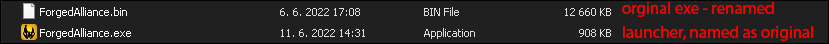
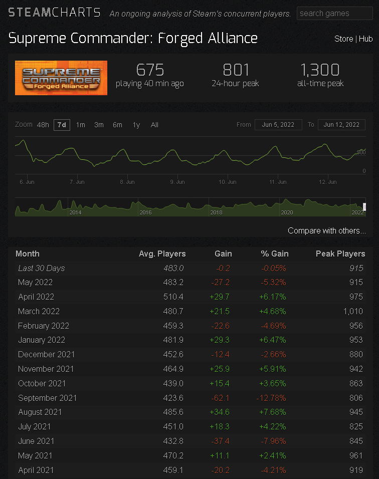
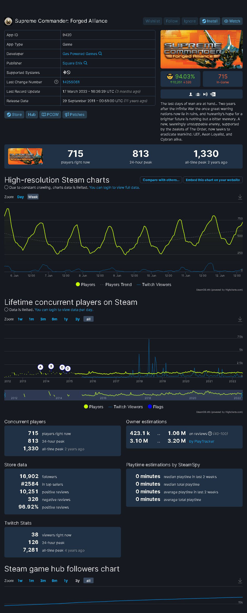

# FAF Steam Wrapper

This is the proof-of-concept of making the Steam activity again - the game launched through the FAF client can now present like so:

## Why?
FAF has undergone a lot of changes and progress, making game faster, playable again - especially the multiplayer, also has dropped the Steam dependency - but for a small price - running this game no longer presents its activity through the Steam. While this move had its own reason, this is probably an unintended side effect.

## Yea, so what?
We are the community, who loves this game - a game which even after so many years is still a hell of a game, which even today's titles are nowhere close.
And at this point is kinda shame, that this game is not producing any today's metering. Lot's of potential players simply don't know, that this game has still a respectful player base.

And this is the goal of this wrapper.
- every launch of the game, it sets the game as a running in your Steam player activity
- this does not mean it'll require Steam running - wrapper simply run the game with no hassles even if it fails contacting Steam Api
- Steam does not have to be even installed
- its a small "launcher" which just tries inform Steam through Api, that game has been launched
- it quits as soon as you close the game
- since FAF now requires the ownership of the original copy of the game, its completely legit

### Concept 1
Launcher .exe will have same name as the `ForgedAlliance.exe` and the original name will be renamed - could be anything, non-conflicting, eq. `ForgedAlliance.bin`

**Pros:**
- no need to change your desktop shortcuts at all - you'll be always launching this wrapper
- no need to change FAF client settings, FAF client would be still calling the same .exe (and launcher does the rest)
- it will always try to lit the activity, even if you launch game directly from the dir, local Lan plays, replays, etc.

**Cons:**
- one small extra process running along with game
- FAF client will have to rename original .exe file to .bin and add it into its internal distribution file-list as the new file

### Concept 2 (draft)
Make this as truly launcher, using different name of the .exe, something like `FAFLauncher.exe` and do the rest just as above - launch the game with prior contacting Steam

**Pros:**
- none, except calling the Steam before the game

**Cons:**
- you'd have to change yours shortcuts on the desktop in case you're not using FAF client for playing and also want to share your activity at the same time - local Lan plays, replays etc.
- one small extra process running along with game, unless you run the original exe directly
- FAF client will have to include launcher .exe file into its internal distribution file-list
- FAF client have to call this new .exe instead of the original .exe
- FAF client would probably require and update of the client in order to utilize this

# Technical info of the launcher - currently for Concept 1:
- self contained exe, all Steam, C# dependencies are self-contained, embedded in the .exe 

        This means that launcher does not conflicts with any .dll's in the game folder

- any arguments passed on the command-line are handed-over to the original game
- added new command-line switch `/nosteam`

        The launcher just run the game - without contacting Steam API and quits - keeping the game run.
        This is mainly for devs, because it allows to run developer sessions still through the wrapper, while allow to keep the renamed launcher in the place.

## Technical info of the launcher - Concept 2:
- this is currently not supported, as it is in form of a draft.

## Statistics (as of 2022-06-12):

- [SteamCharts:](https://steamcharts.com/app/9420)
  

- [SteamDB:](https://steamdb.info/app/9420)
  
